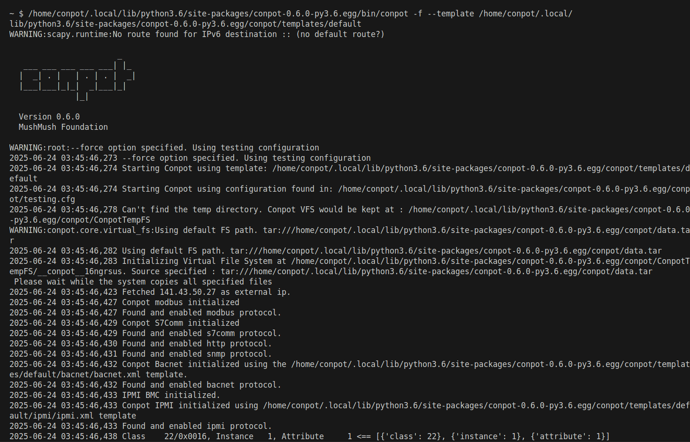
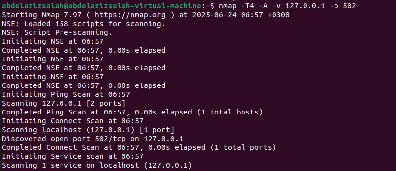
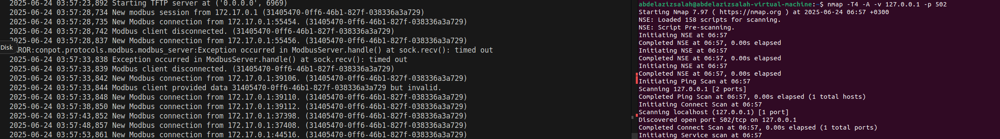
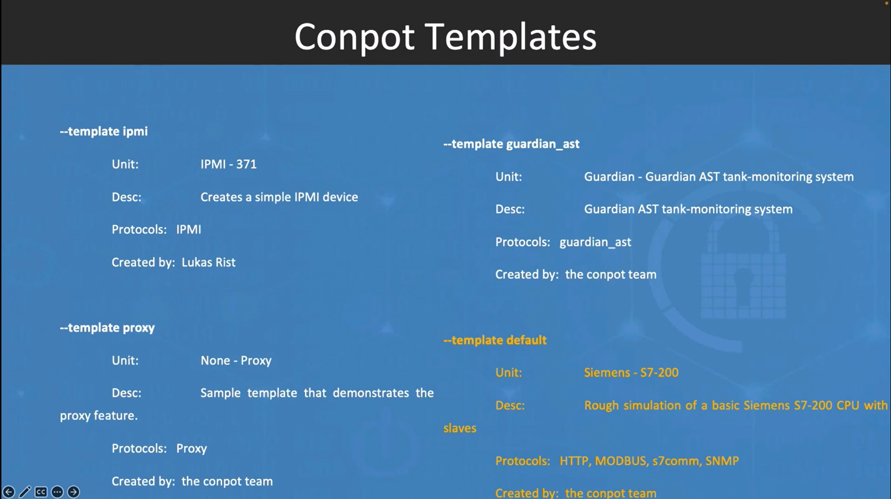

# How to install Conpot
- we use the docker image via a pre-built image
  - install docker
  - run 
    - > docker pull honeynet/conpot
  - run 
    - > sudo docker run -it -p 80:80 -p 127.0.0.1:102:10201 -p 127.0.0.1:502:5020 --network=bridge honeynet/conpot:latest /bin/sh
  - then run
    - > /home/conpot/.local/lib/python3.6/site-packages/conpot-0.6.0-py3.6.egg/bin/conpot -f --template /home/conpot/.local/lib/python3.6/site-packages/conpot-0.6.0-py3.6.egg/conpot/templates/default
  - then this is the output, with a lot of services run in the background: 
    - 
  - on performing nmap scan using this command: 
    - >  nmap -T4 -A -v 127.0.0.1 -p 502
    - and this is Nmap response, detecting that port 502 is open
    - 
  - It can be seen that conpot detected the connection as shown in the screenshot:
    - 
## Structure of Conpot: 
- Conpot comes with many templates as shown in the screenshot:
  - 
  - I need to understand the differences between these templates.

## Note
- they suggest that if we want to write our own template, to change ports, etc, to perform host installation (maybe later)
- [from this link](https://conpot.readthedocs.io/en/latest/installation/install.html)