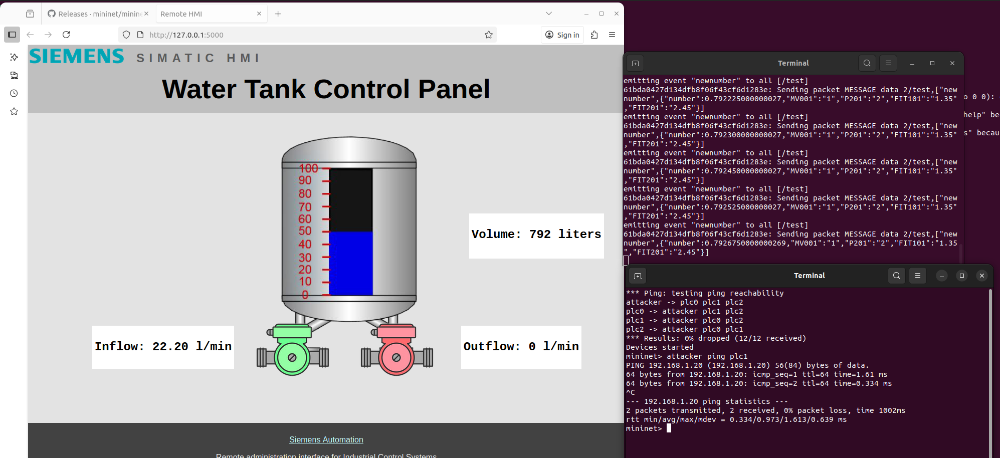

# Installing ICSpot on Ubuntu 22.04.05
* after successfully install mininet, and minicps, I managed to successfully connect to the water tank simulation
  * 
* and on the right, we can see a terminal showing the packets simulating the process, and the other terminal allowing us to send requests in the mininet, simulaitng attacker for example pinging one of the plcs.
* and this website is simulating the HMI running on port 5000.
# main problem
* now the problem is the honeyd does not work on Ubuntu 22.04.05
* so I will try to make it work on ubuntu 18.04 and see how to fix this later.