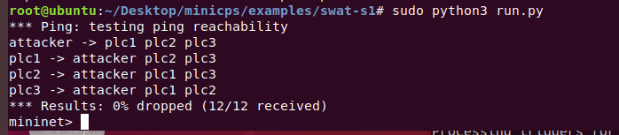
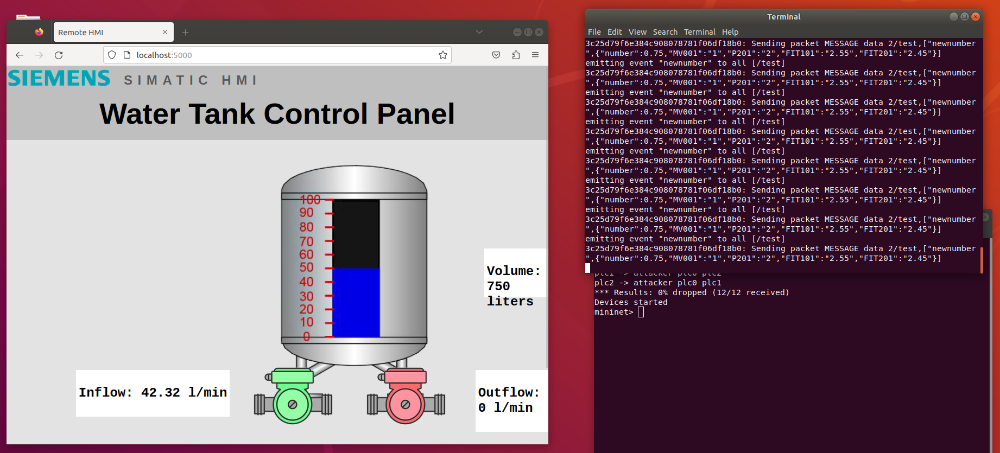
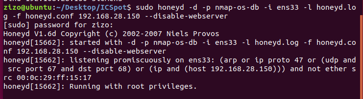
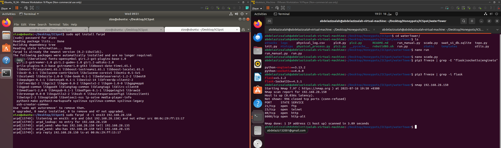

# Ubuntu 18.04
1. I finished installing mininet, and minicps
   * 
   * make sure to use **python3** not python
 * while trying to make it run on Ubuntu 18.04, I face some problems with the versions, and I found out, that those are the versions needed by watertank simulator to work:
   * pip3 freeze | grep -E "flask|socketio|engineio" 
python-engineio==3.13.2
python-socketio==4.6.0
abdelazizsalah@abdelazizsalah-virtual-machine:~/Desktop/Honeypots/ICSpot/waterTower$ pip3 freeze | grep -i flask
Flask==1.1.2
Flask-SocketIO==4.3.1
* now it is working on Ubuntu 18.04
  * 
* NOW I RAN HONEYD:
  * 

# TESTING THE HONEYPOT
* 
* we can see that the nmap saw that there are some ports actually open, and the honeypot is good simulating the process.
* I stopped at the logging part of ICSpot readme
  > sudo honeyd -d -p nmap-os-db -i ens33 -l honeyd.log -f honeyd.conf 192.168.28.150 --disable-webserver

  > sudo farpd -d -i ens33 192.168.28.150