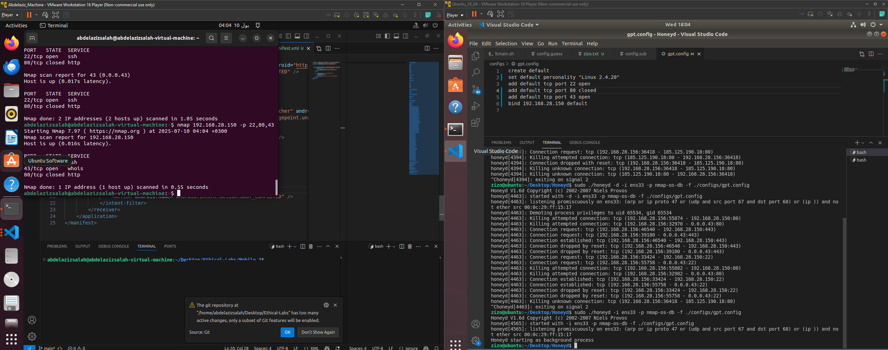

# How Honeyd works
1. The main issue was that we can not run honeyd on a machine, and scan it from the same machine.
2. Because honeyd prevent self scanning ...... ( that was my main issue )
3. so we must run it on one machine, and scan it from another machine
   * 

## Steps to get it work: 
* we need atleast two machines
    1. Scanner
    2. Honeyd host
### Honeyd Host ( from Ubuntu 18_04 )
1. check what is your ip on the machine which will run honeyd
   > ip a
2. select an empty ip, which is not used
   1. test all used ips using this command: 
      > nmap -sn 192.168.28.0/24
   2. then select one which is not up (192.168.28.150) for example
   3. in the configuration file bind it and define all the ports you want to set (i.e. 22, 80, 43)
      1. 
3. run honeyd
    > sudo ./honeyd -i ens33 -p nmap-os-db -f ./configs/trial.config
    - -p for the fingerprint file
    - -i for the interface
    - -f for the configuration file
    - -d for the debuging mode
### Scnner (from Ubuntu 22_04)
1. sudo arp -s 192.168.28.150 00:0c:29:ff:15:17
   1. this command manually assign the ip 192.168.28.150 to the mac address of ens33 ethernet interface of the honeyd host
   2. I think there is an issue here, because this is done manually, so if we did not perform this, the ip 192.168.28.150 is not connected to any machine, so when a packet come to it, nobody will respond, and the ports will be seen down.
   3. ask professor, does he know a work around for this, to make it work without manually setting it up.
2. scan the ports:
    > nmap 192.168.28.150
3. you should see only the ports you opened manually in the configuration file:
   1. 
4. important note, all ports are set to be open by default if you did not close them in the configuration using this command: 
   1. set default default tcp action reset