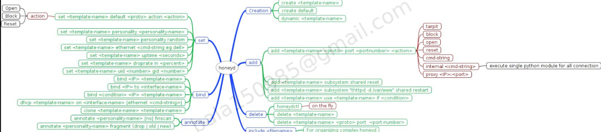
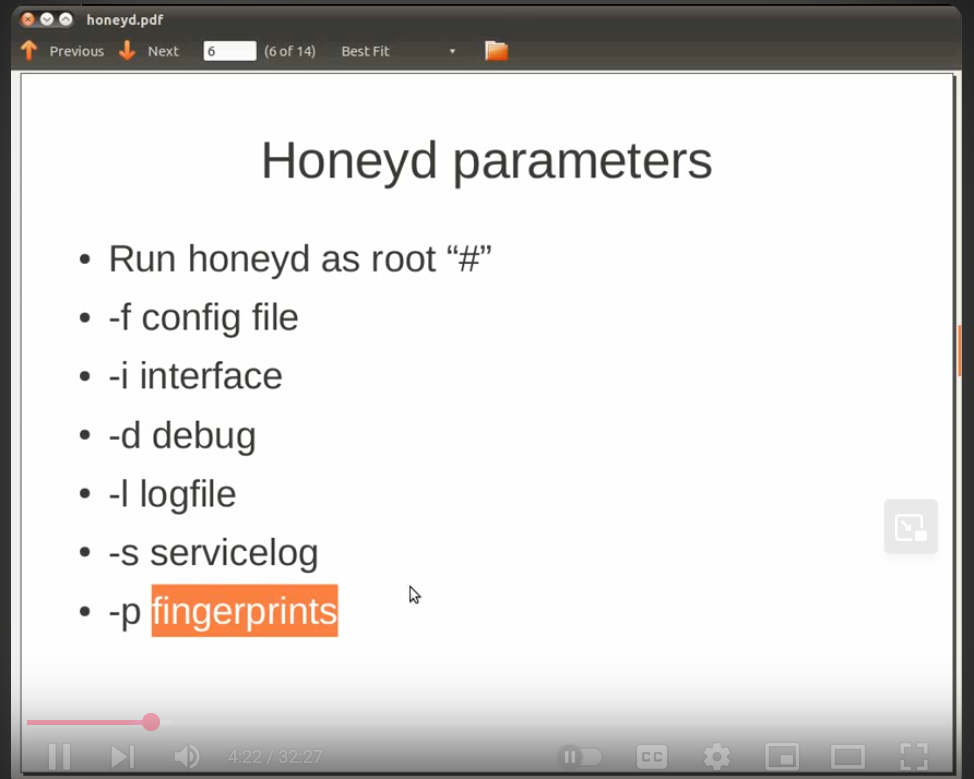

# Honeyd how it works
1. Setup a configuration file
- this file tells Honeyd what kind of fake hosts to simulate
- this is the map how it works:
  - 
- so we can create a file called **example.conf**
- fill it with this content: 
  ```
    create default // defines a template device
    set default personality "Linux 2.4.20" // Simulates an OS fingerprint
    add default tcp port 80 open  // Opens fake services
    add default tcp port 22 open  // Opens fake service
    bind 192.168.28.120 default   // binds the fake machine to an **unused** IP address
  ```

2. run Honeyd
-   we should use this command to run honeyd:
    -   > sudo /home/abdelazizsalah/Desktop/Honeypots/Honeyd_1.6d/honeyd -f /home/abdelazizsalah/Desktop/Honeypots/Honeyd_1.6d/configs/simple.config -p /home/abdelazizsalah/Desktop/Honeypots/Honeyd_1.6d/nmap-os-db -l /var/log/honeypot/honeyd.log


- -d used for debug mode to print to the terminal
- -f  path to the configuration file
- -p path to the OS fingerprints
- -l path to where to write the logs of the connection attempts
- we should make sure that the /var/log/honeypot folder exists


3. now we can start scaning the fake hosts
- nmap -sS 192.168.28.120
- we should see 
  - 22/tcp open ssh
  - 80/tcp open http
- this means that the fake host is alive and responding

4. we can simulate multiple hosts
   - add more entries in the config file:
    ```
    create default // defines a template device
    set default personality "Linux 2.4.20" // Simulates an OS fingerprint
    add default tcp port 80 open  // Opens fake services
    add default tcp port 22 open  // Opens fake service
    bind 192.168.28.120 default   // binds the fake machine to an **unused** IP address

    create windows
    set windows personality "Windows XP SP1"
    add windows tcp port 139 open
    add windows tcp port 445 open
    bind 192.168.28.121 windows
    ```

## Summary cheat sheet
| Command                     | Purpose                      |
| --------------------------- | ---------------------------- |
| `create NAME`               | Create a template system     |
| `set NAME personality "OS"` | Assign a fake OS fingerprint |
| `add NAME tcp port XX open` | Open fake ports              |
| `bind IP NAME`              | Bind fake host to an IP      |
| `-f`                        | Config file                  |
| `-p`                        | Personality file             |
| `-l`                        | Log file                     |


## Files explainatino: 

| File Name            | Description                                                                                                                                                                   |
| -------------------- | ----------------------------------------------------------------------------------------------------------------------------------------------------------------------------- |
| **`example.conf`**   | A sample Honeyd configuration file. It defines how to simulate virtual hosts, open ports, and assign personalities. Use this as a reference to build your own config.         |
| **`honeydsum.conf`** | A specific configuration used for simulating multiple honeypots (SUM = Simulated Unix Machines). Includes multiple templates and bindings.                                    |
| **`kuang2.conf`**    | Another sample Honeyd config, based on the *Kuang2* honeynet demo. It simulates a small fake enterprise network. Useful for learning or demos.                                |
| **`nmap.assoc`**     | Maps Honeyd “personality” names to fingerprints in the `nmap.prints` file. It tells Honeyd which OS fingerprint to use when you set `personality "Windows XP"` etc.           |
| **`nmap-os-db`**     | The modern Nmap OS fingerprint database (used by newer Nmap versions). ⚠️ **Not fully compatible** with Honeyd; using this may cause `SEQ(...)` parse errors.                 |
| **`nmap.prints`**    | ✅ The correct OS fingerprint file format used by Honeyd to simulate TCP/IP stack behavior of various operating systems. This file must be used with `-p` when running Honeyd. |
| **`scripts/`**       | A directory containing service emulation scripts. For example, scripts that simulate banners or responses on fake services (e.g., HTTP, SSH, FTP).                            |
| **`xprobe2.conf`**   | Configuration for `xprobe2` integration, a tool for active OS fingerprinting. Can be used alongside Honeyd for more accurate fingerprinting or detection evasion.             |


## Honeyd parameters:

- -p fingerprints: this is the file from which honeyD learns how to respond to any comming request based on the fingerprint of the OS to fool the attacker.