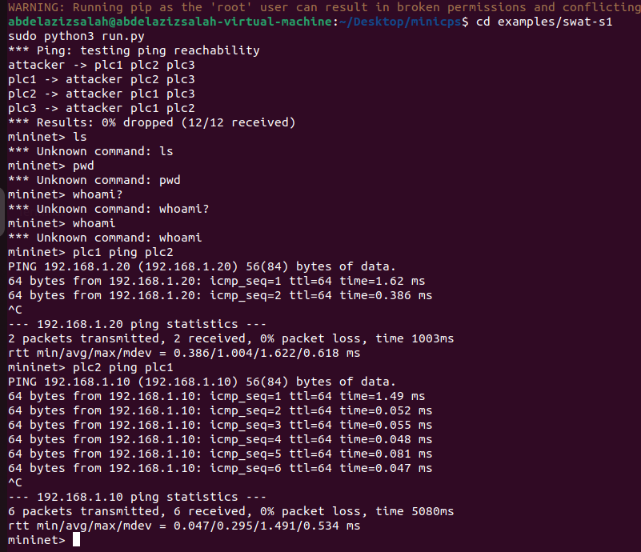
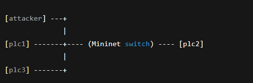
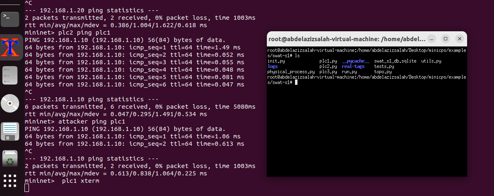
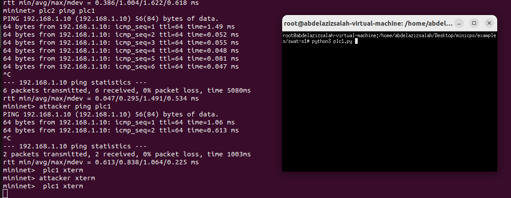
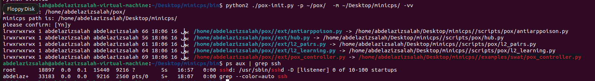
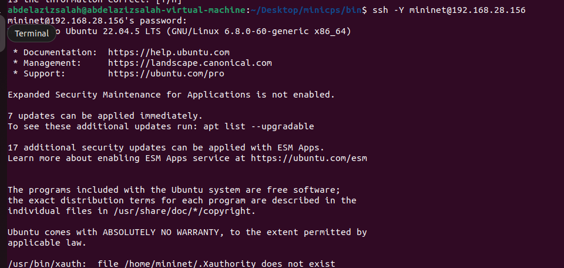
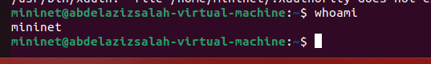
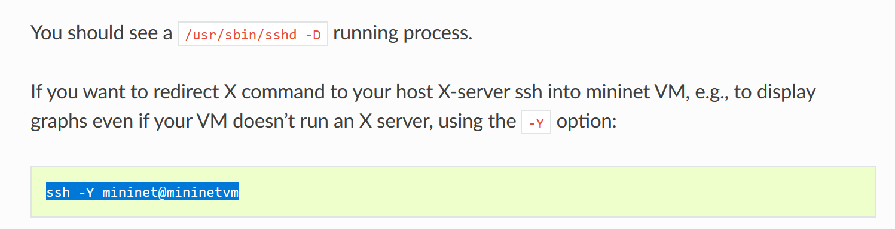
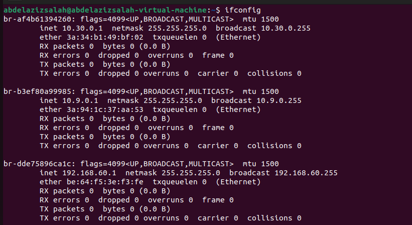

# minicps
* I managed to install minicps, and run one of its scripts, and try to ping 2 plc devices, and I got the following results:
  * 
* this is how the network looks like:
  * 
* and we can ping any two devices on the network
  * attacker ping plc1 
  * plc1 ping attacker
  * and so on.
* we can open a shell on plc1 using this command: 
  * plc1 xterm
  * and this should be the result
    * 
  * I do not understand yet what does this mean, but I will further explore it. 
* then from this terminal we can simulate real plc by using command:
  * > python3 plc1.py
  * 
* however I get errors because I need to understand the logic of the script plc1.py, it seems that they use certain key that I need to replace in the code.
* on installing mininet, we will always find sshd running on the background, we can check it using this command: 
  * > ps aux | grep ssh
  * 
  * we can se /usr/bin/sbin/sshd [listner]
* now we can create a user on the machine
  * > sudo adduser mininet
* and we can try to connect to him using ssh
* > 
* I choose password zizo for him, and we can see we are connected to him with user mininet
  * > 
* this is helpful for this reson from thier documentation
  * 
* they also advise to reduce the ipv6 traffic
  * 
  * and I did as they mentioned.
  * when I read about this, they mention that it reduces unnecessary traffic, and also most ICS uses older services that does not use IPv6, so this reduces the exposure. 
  * now we can see that my machine does not include IPv6
    * 